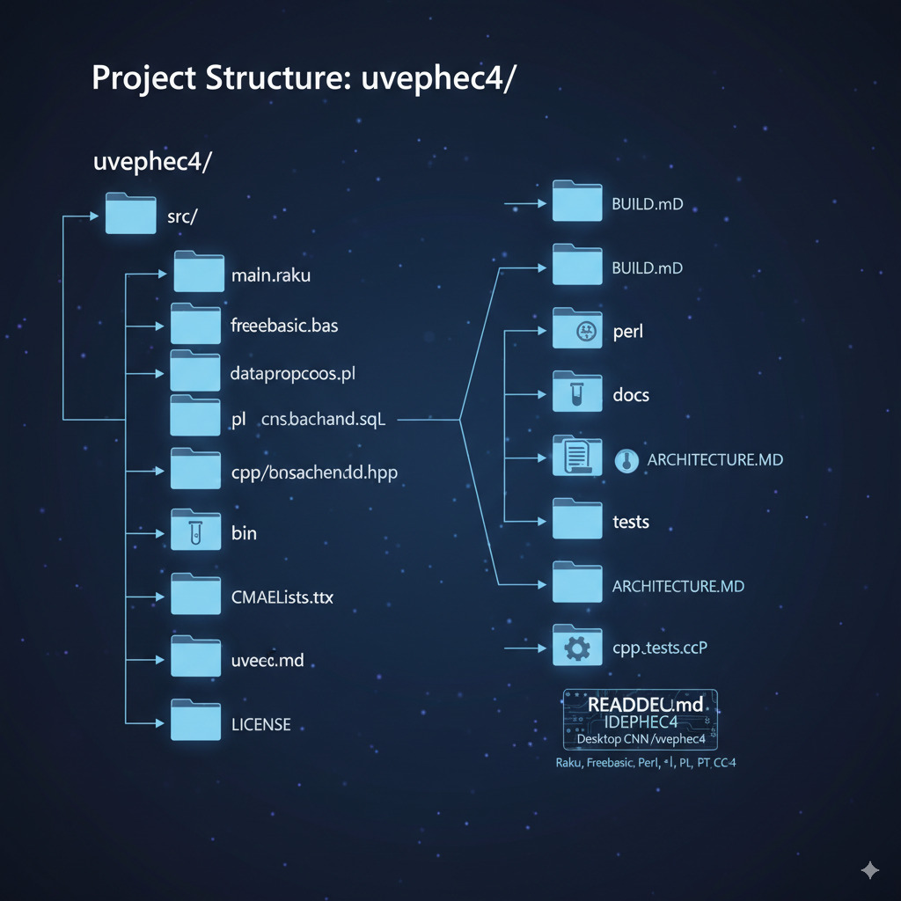

Project Name: `uvephec4`

This repository contains the `uvephec4` project, a desktop application implementing a Convolutional Neural Network (CNN) for various tasks. The project is developed using a combination of programming languages: Raku, Freebasic, Perl, PL, PT, and C++.

________

## Table of Contents

*   [Features](#features)
*   [Technologies Used](#technologies-used)
*   [Installation](#installation)
*   [Usage](#usage)
*   [Project Structure](#project-structure)
*   [Contributing](#contributing)
*   [License](#license)

## Features

*   **Convolutional Neural Network (CNN) Implementation:** Core CNN architecture for image processing and pattern recognition.
*   **Desktop Application:** User-friendly interface for interacting with the CNN.
*   **Multi-language Integration:** Leverages the strengths of Raku, Freebasic, Perl, PL, PT, and C++ for different components.
*   **Modular Design:** Allows for easy extension and modification of CNN layers and application features.
*   **Cross-platform Compatibility:** Designed to run on various desktop operating systems.

## Technologies Used

*   **Raku:** Used for high-level control, data manipulation, and potentially parts of the CNN logic.
*   **Freebasic:** Employed for performance-critical sections, potentially low-level graphics or numerical computations.
*   **Perl:** Utilized for scripting, text processing, and system integration tasks.
*   **PL:** (Assuming PL/pgSQL or a similar Procedural Language) Potentially used for database interactions or complex data handling.
*   **PT:** (Please specify if this refers to a specific language like Python, or a domain-specific language) This will be clarified as the project evolves.
*   **C++:** For optimal performance in core CNN algorithms, memory management, and potentially system-level interactions.

Here's an example of a typical CNN architecture you might find in this project: 

